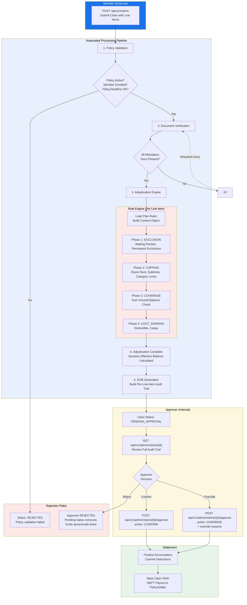

# Product Requirements Document (PRD): Indian Health Insurance Claims Processing System

## 1. Technology Stack
*   **API Framework:** FastAPI (Python)
*   **Database:** PostgreSQL
*   **Data Serialization/Validation:** Pydantic (Standard with FastAPI)
*   **Seeding & Infrastructure:** Docker with PostgreSQL `init.sql` scripts to load the initial Plans, Rules, Policies, and Members automatically.

---

## 2. Database Schema (PostgreSQL)

The database design uses highly normalized tables for core entities and utilizes `JSONB` columns for flexible configurations (like rule conditions and dynamic accumulator buckets).

### 2.1 Enums (Shared Value Sets)

These enums are the **single source of truth** for all valid values across the system. Rules, API payloads, and DB columns all reference these.

#### `ServiceCategory`
Defines the valid categories for a line item on a hospital bill.
```
ROOM_RENT | ICU_CHARGES | CONSULTATION | OT_CHARGES | PHARMACY |
DIAGNOSTICS | DENTAL | AYUSH | CONSUMABLES | COSMETIC | COSMETIC_SURGERY | SURGERY | OTHER
```

#### `ClaimType`
```
REIMBURSEMENT | CASHLESS
```

#### `ClaimStatus`
```
SUBMITTED | VALIDATED | PENDING_APPROVAL | APPROVED | PARTIALLY_APPROVED | DENIED | PAID
```

#### `ManualApprovalStatus`
```
PENDING | APPROVED | OVERRIDDEN | REJECTED
```

#### `LineItemStatus`
```
SUBMITTED | APPROVED | DENIED | PARTIALLY_APPROVED | EXCLUDED
```

#### `ExecutionPhase`
The fixed-order pipeline phases for rule evaluation.
```
EXCLUSION | CAPPING | COVERAGE | COST_SHARING
```

#### `ActionType`
The specific financial handler a rule triggers.
```
EXCLUDE | LIMIT | COPAY | DEDUCTIBLE
```

#### `Gender`
```
MALE | FEMALE | OTHER
```

---

### 2.2 Core Entities

#### `plans`
| Column | Type | Constraints | Description |
| :--- | :--- | :--- | :--- |
| `id` | UUID | PK | Unique plan identifier |
| `name` | String | NOT NULL | Product name (e.g., "General Health Plan") |
| `description` | Text | | Brief description of the plan's coverage scope |
| `allowed_sum_insured_options` | JSONB | NOT NULL | Array of SI tiers (e.g., `[500000, 1000000, 2500000]`) |
| `is_active` | Boolean | DEFAULT true | Whether this plan is currently sold |
| `created_at` | Timestamp | DEFAULT NOW() | Record creation time |

#### `policies`
| Column | Type | Constraints | Description |
| :--- | :--- | :--- | :--- |
| `id` | UUID | PK | Unique policy contract identifier |
| `plan_id` | UUID | FK → plans.id, NOT NULL | Which plan blueprint this policy uses |
| `chosen_sum_insured` | Decimal | NOT NULL | The SI tier the customer selected from the plan's options |
| `tenure_start` | Date | NOT NULL | Policy start date |
| `tenure_end` | Date | NOT NULL | Policy end date |
| `policyholder_name` | String | NOT NULL | Legal name of the contract owner |
| `policyholder_contact` | JSONB | | `{"mobile": "...", "email": "..."}` |
| `policyholder_kyc` | JSONB | | `{"pan": "...", "aadhaar": "..."}` |
| `bank_account_details` | JSONB | | `{"account_holder": "...", "bank_name": "...", "account_number": "...", "ifsc_code": "..."}` |
| `created_at` | Timestamp | DEFAULT NOW() | |

#### `members`
| Column | Type | Constraints | Description |
| :--- | :--- | :--- | :--- |
| `id` | UUID | PK | Unique member identifier |
| `policy_id` | UUID | FK → policies.id, NOT NULL | Policy this member is covered under |
| `full_name` | String | NOT NULL | Member's legal name |
| `date_of_birth` | Date | NOT NULL | Used to compute age dynamically |
| `gender` | Gender Enum | NOT NULL | `MALE`, `FEMALE`, `OTHER` |
| `relationship` | String | NOT NULL | Relationship to policyholder: `SELF`, `SPOUSE`, `CHILD`, `PARENT` |
| `ped_list` | JSONB | DEFAULT '[]' | Array of pre-existing disease ICD-10 codes |

#### `accumulators`
| Column | Type | Constraints | Description |
| :--- | :--- | :--- | :--- |
| `policy_id` | UUID | PK, FK → policies.id | One accumulator record per policy |
| `available_sum_insured` | Decimal | NOT NULL | Remaining SI balance |
| `accumulated_ncb` | Decimal | DEFAULT 0 | No Claim Bonus earned so far |
| `active_deductible_paid` | Decimal | DEFAULT 0 | Deductible paid by member this policy year |
| `category_usage` | JSONB | DEFAULT '{}' | Map of category-level usage: `{"DENTAL": 20000, "AYUSH": 0}` |

---

### 2.3 Rule Engine Configurations

#### `rules`
| Column | Type | Constraints | Description |
| :--- | :--- | :--- | :--- |
| `id` | UUID | PK | Unique rule identifier |
| `plan_id` | UUID | FK → plans.id, NOT NULL | Plan this rule belongs to |
| `name` | String | NOT NULL | Human-readable rule name |
| `execution_phase` | ExecutionPhase Enum | NOT NULL | `EXCLUSION`, `CAPPING`, `COVERAGE`, `COST_SHARING` |
| `priority` | Integer | NOT NULL | Execution order within phase (lower = first) |
| `condition` | JSONB | NOT NULL | Generic DSL condition tree |
| `action_type` | ActionType Enum | NOT NULL | `EXCLUDE`, `LIMIT`, `COPAY`, `DEDUCTIBLE` |
| `action_config` | JSONB | NOT NULL | Parameters for the handler |
| `is_active` | Boolean | DEFAULT true | Toggle rule on/off |

---

### 2.4 Claim Transactions

#### `claims`
| Column | Type | Constraints | Description |
| :--- | :--- | :--- | :--- |
| `id` | UUID | PK | Unique claim identifier |
| `policy_id` | UUID | FK → policies.id, NOT NULL | Policy being claimed against |
| `member_id` | UUID | FK → members.id, NOT NULL | Member who received treatment |
| `diagnosis_codes` | JSONB | NOT NULL | Array of ICD-10 strings (e.g., `["I21", "E11.9"]`) |
| `claim_type` | ClaimType Enum | NOT NULL | `REIMBURSEMENT` or `CASHLESS` |
| `is_accident` | Boolean | DEFAULT false | Exempts from initial waiting period |
| `admission_date` | Date | NOT NULL | Date of hospital admission |
| `discharge_date` | Date | NOT NULL | Date of hospital discharge |
| `status` | ClaimStatus Enum | DEFAULT 'SUBMITTED' | Current pipeline state |
| `documents_attached` | JSONB | DEFAULT '[]' | List of document types uploaded |
| `total_billed` | Decimal | DEFAULT 0 | Sum of all line item billed amounts |
| `total_insurer_payable` | Decimal | DEFAULT 0 | Sum after all rules applied |
| `total_member_payable` | Decimal | DEFAULT 0 | Member's out-of-pocket liability |
| `created_at` | Timestamp | DEFAULT NOW() | Record creation time |

#### `line_items`
| Column | Type | Constraints | Description |
| :--- | :--- | :--- | :--- |
| `id` | UUID | PK | Unique line item identifier |
| `claim_id` | UUID | FK → claims.id, NOT NULL | Parent claim |
| `service_category` | ServiceCategory Enum | NOT NULL | `ROOM_RENT`, `ICU_CHARGES`, etc. |
| `billed_amount` | Decimal | NOT NULL | Original hospital charge |
| `allowed_amount` | Decimal | DEFAULT 0 | Amount after capping/exclusions |
| `insurer_payable` | Decimal | DEFAULT 0 | Final amount insurer pays |
| `status` | LineItemStatus Enum | DEFAULT 'SUBMITTED' | Per-item adjudication outcome |
| `audit_trail` | JSONB | DEFAULT '[]' | Ordered array of adjustment records |

---

### 2.5 Rule Engine Context Object

This is the **flattened key-value map** built by the application layer before passing to the rule engine. **Every field a rule condition can reference MUST exist in this schema.** This is the contract between the rule definitions and the engine.

| Context Key | Source | Type | Description |
| :--- | :--- | :--- | :--- |
| `policy.plan_id` | `policies.plan_id` | UUID | Plan blueprint ID |
| `policy.chosen_sum_insured` | `policies.chosen_sum_insured` | Decimal | Customer's selected SI tier |
| `policy.tenure_start` | `policies.tenure_start` | Date | Policy start date |
| `policy.tenure_end` | `policies.tenure_end` | Date | Policy end date |
| `member.age` | **Computed** from `members.date_of_birth` | Integer | Member's current age |
| `member.gender` | `members.gender` | String | `MALE`, `FEMALE`, `OTHER` |
| `member.ped_codes` | `members.ped_list` | Array[String] | Pre-existing disease ICD-10 codes |
| `member.days_active` | **Computed** from `policies.tenure_start` | Integer | Days since policy started |
| `member.relationship` | `members.relationship` | String | `SELF`, `SPOUSE`, `CHILD`, `PARENT` |
| `claim.diagnosis_codes` | `claims.diagnosis_codes` | Array[String] | ICD-10 codes for this claim |
| `claim.is_accident` | `claims.is_accident` | Boolean | Whether claim is accident-related |
| `claim.admission_date` | `claims.admission_date` | Date | Admission date |
| `claim.discharge_date` | `claims.discharge_date` | Date | Discharge date |
| `claim.claim_type` | `claims.claim_type` | String | `REIMBURSEMENT` or `CASHLESS` |
| `line_item.service_category` | `line_items.service_category` | String | `ROOM_RENT`, `PHARMACY`, etc. |
| `line_item.billed_amount` | `line_items.billed_amount` | Decimal | Original charge for this item |
| `accumulator.available_sum_insured` | `accumulators.available_sum_insured` | Decimal | Remaining SI |
| `accumulator.category_usage` | `accumulators.category_usage` | Map | `{"DENTAL": 20000, ...}` |
| `accumulator.active_deductible_paid` | `accumulators.active_deductible_paid` | Decimal | Deductible paid so far |

#### Computed Fields (Not Stored, Derived at Runtime)
*   `member.age` = `(current_date - members.date_of_birth).years`
*   `member.days_active` = `(current_date - policies.tenure_start).days`


---

## 3. API Endpoints Specification

API routes are strictly separated between external actions (Member App) and internal operations (Admin/Approver portals).

### A. Member Endpoints (External)
Accessed by the policyholder to file and track claims.

| Method | Endpoint | Payload / Behavior |
| :--- | :--- | :--- |
| `POST` | `/api/v1/claims` | **Submit Reimbursement Claim:** Accepts `policy_id`, `member_id`, `diagnosis_codes` (Array), and `line_items`. Triggers pipeline up to `PENDING_APPROVAL`. |
| `GET` | `/api/v1/claims/{claim_id}` | **Check Status:** Returns high-level claim status and final financial totals. |
| `GET` | `/api/v1/claims/{claim_id}/eob` | **Download EOB:** Returns the finalized Explanation of Benefits detailing member liability and adjustment reasons. |

### B. Admin / Internal Endpoints (Approver)
Accessed by insurance company claims adjusters and underwriters.

| Method | Endpoint | Payload / Behavior |
| :--- | :--- | :--- |
| `GET` | `/api/v1/admin/claims/{claim_id}` | **Approver View:** Returns the claim including the **full per-line-item audit trail** generated by the engine. |
| `POST` | `/api/v1/admin/claims/{claim_id}/approve` | **Manual Approval:** Accepts `action` (`CONFIRM` or `OVERRIDE`) and optional override reasons. Finalizes accumulators and moves claim to `PAID` or `DENIED`. |
| `POST` | `/api/v1/admin/plans` | **Create Plan:** Ingests a new Plan object along with its associated generic JSON Rules. |
| `GET` | `/api/v1/admin/plans/{plan_id}` | **View Plan:** Returns plan details and active rules. |
| `POST` | `/api/v1/admin/policies` | **Issue Policy:** Creates a new Policy contract for a member. |
| `GET` | `/api/v1/admin/policies/{policy_id}` | **Inspect Balances:** Returns a policy's static details and its dynamic **Accumulator balances**. |

---

## 4. Architecture Flow: Claim Processing Pipeline



### Flow Summary

1. **Member submits** a claim with line items via `POST /api/v1/claims`.
2. **Policy Validation** checks if the policy is active, member is enrolled, and filing is within deadline. Fails → `REJECTED`.
3. **Document Verification** checks mandatory documents.
4. **Adjudication Engine** runs the Rule Engine on each line item through 4 fixed phases: `EXCLUSION` → `CAPPING` → `COVERAGE` → `COST_SHARING`. Each phase logs its deductions to the line item's `audit_trail`. (Zero-impact rules are intelligently filtered out to reduce noise).
5. **Dynamic Effective Balance**: No physical database accumulator updates occur yet. Instead, any future claims will dynamically calculate their available balance by subtracting this claim's PENDING_APPROVAL totals.
6. **EOB Generation** builds the final Explanation of Benefits with per-line-item status and explanations.
7. Claim halts at **`PENDING_APPROVAL`**. Line items reflect the system's recommended statuses.
8. **Approver reviews** the full audit trail via `GET /api/v1/admin/claims/{id}` and submits their decision via `POST /api/v1/admin/claims/{id}/approve`:
   - **CONFIRM** → Accept the engine's output as-is.
   - **OVERRIDE** → Adjust amounts/statuses with mandatory reason (logged in audit trail).
   - **REJECT** → Deny the claim entirely (dynamically frees up the locked funds).
9. On approval, physical database accumulators are **hard-debited** and the claim moves to **`PAID`**.
