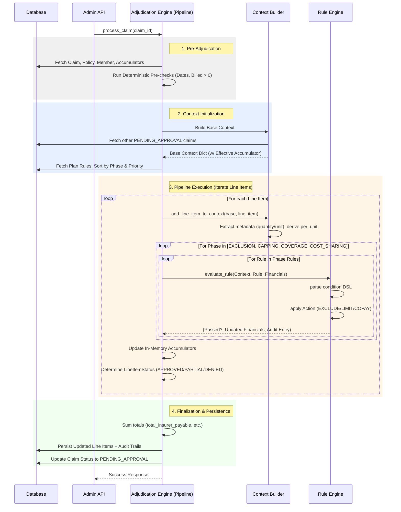

# Engines Architecture: Adjudication vs Rule Engine

The core of the claim processing pipeline is divided into two distinct components: the **Adjudication Engine** (the stateful orchestrator) and the **Rule Engine** (the stateless logic evaluator). 

This strict separation of concerns ensures that business logic remains declarative and isolated from database operations, accumulator tracking, and workflow orchestration.

---

## 1. The Rule Engine (Pure Evaluator)

### **Responsibilities**
The Rule Engine is a purely stateless, side-effect-free evaluator. It evaluates a single JSON rule against a flat dictionary (the Context Object) and applies a financial mutation (Action) if the condition matches.
- **Condition Parsing**: Evaluates nested logical operators (`all`, `any`, `not`) and comparators (`EQ`, `GT`, `INTERSECTS`, etc.) against the context. The condition acts purely as a selector ("Does this rule apply?").
- **Action Execution**: Applies financial mutations (`EXCLUDE`, `LIMIT`, `COPAY`, `DEDUCTIBLE`) to the line item's `allowed_amount`, `insurer_payable`, and `member_payable` based on the rule config.
- **Audit Generation**: Returns a read-only audit trail entry explaining what financial mutation occurred and why. (Note: Zero-impact mutations are filtered out by the Orchestrator to prevent EOB noise).

### **What it DOES NOT do**
- It does not read from or write to the database.
- It does not know about other line items in the claim.
- It does not track aggregate state (like "total diagnostics used so far").

### **Examples of What the Rule Engine Handles**
1. **Simple Exclusions**: "If `member.days_active` < 730 AND `claim.diagnosis_codes` contains E11, apply EXCLUDE action."
2. **Fixed Unit Capping**: "If `line_item.service_category` is ROOM_RENT, cap the allowed amount to (Rs. 5,000 * `line_item.metadata.duration_days`)."
3. **Flat Copays**: "Apply 20% COPAY deduction to the allowed amount."

### **V1 Limitations & Edge Cases (Rule Engine)**
* **Cross-Line-Item Math**: The Rule Engine evaluates one line item at a time. It cannot handle rules like "If Room Rent exceeds limit, proportionally reduce all other associated line items by the same ratio." This requires a multi-item processing phase.
* **Complex Multi-Condition Thresholds**: While the DSL supports `INTERSECTS` and `all`, deeply complex dynamic lookups (e.g., "Limit to 10% of total policy SI OR Rs. 50,000, whichever is lower") require the context builder to pre-compute the threshold or future DSL extensions.

---

## 2. The Adjudication Engine (Orchestrator)

### **Responsibilities**
The Adjudication Engine is the stateful orchestrator. It fetches data, normalizes inputs, runs the pipeline phases, tracks state across multiple line items, and persists the final results.
- **Pre-checks**: Runs hardcoded, deterministic validations before evaluating any rules (e.g., claim date falls within policy tenure).
- **Context Building**: Fetches Policy, Member, Accumulator, and Line Item data to build the massive, flat `Context Object` dictionary for the Rule Engine.
- **Dynamic Normalization**: Computes derived fields like `line_item.per_unit_amount` from `metadata` to make rule definitions cleaner.
- **Pipeline Phasing**: Evaluates rules sequentially across 4 phases: `EXCLUSION` -> `CAPPING` -> `COVERAGE` -> `COST_SHARING`.
- **In-Memory Accumulator Tracking**: Tracks cross-line-item aggregate limits. For example, if a policy has a Rs. 20,000 diagnostics cap, the Pipeline tracks the running total across all diagnostics line items in the claim and passes the *remaining* balance to the Rule Engine in the context.
- **Status Determination**: Decides if a line item is `APPROVED`, `PARTIALLY_APPROVED`, `DENIED`, or `EXCLUDED` based on the final financials returned by the Rule Engine.

### **Examples of What the Adjudication Engine Handles**
1. **Aggregate Capping**: A claim has 3 Diagnostics line items totalling Rs. 30,000. The policy has a Rs. 20,000 cap. The Pipeline updates the `accumulator.DIAGNOSTICS` context variable in-memory after each line item, ensuring the 3rd line item hits the limit and is partially/fully denied.
2. **Sum Insured Exhaustion**: If a policy only has Rs. 1,20,000 remaining SI, but the line items total Rs. 1,35,000, the Pipeline's COVERAGE phase passes an in-memory `accumulator.SUM_INSURED` to the Rule Engine. The final line item that breaches the limit gets `PARTIALLY_APPROVED` (e.g., insurer pays 10k, member pays 15k).
3. **Idempotency**: Computes the *effective* accumulator balance by subtracting totals from other `PENDING_APPROVAL` claims, ensuring the same limits aren't spent twice during concurrent claim evaluations.

### **V1 Limitations & Edge Cases (Adjudication Engine)**
* **Proportional Line-Item Reductions**: Currently, line items are processed sequentially. If the 3rd line item breaches a limit, only that item is capped. It does not go back and retroactively distribute the cap proportionally across all line items in the category.
* **Complex Multi-Claim Deductibles**: While `active_deductible_paid` is tracked, complex family-floater level deductibles where members have individual vs family thresholds are simplified in V1 to a single policy-level tracker.

---

## 3. Claim Processing Flow Diagram

Below is the execution flow of a single claim passing through the system:

