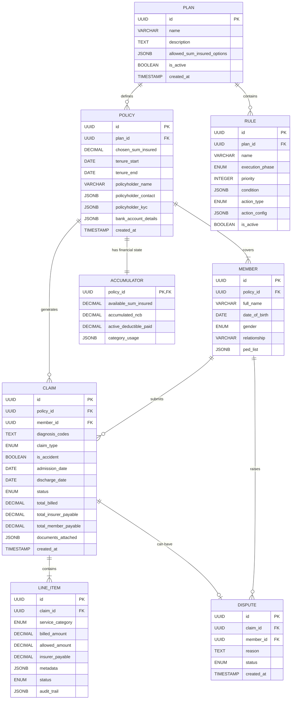
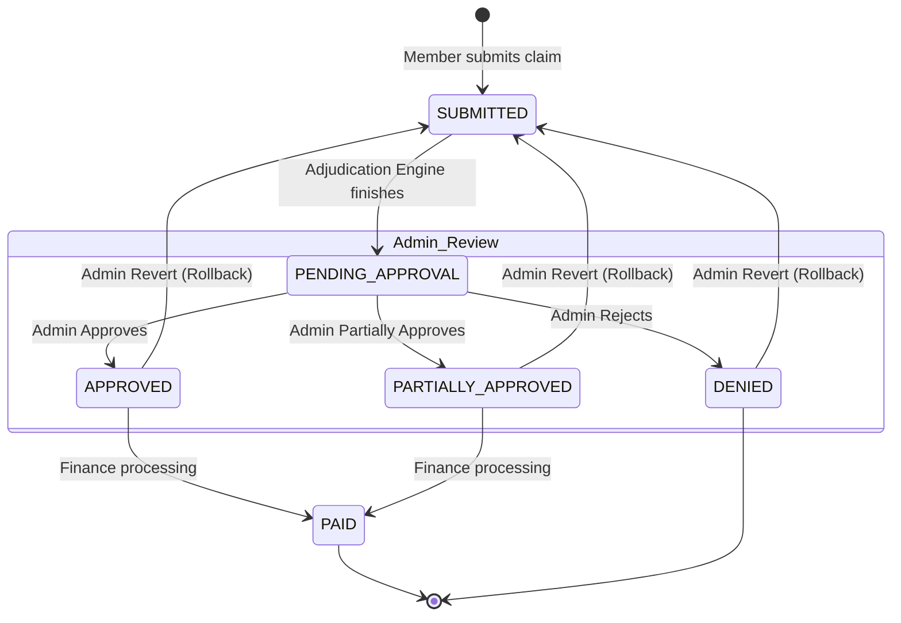

# Domain Model & Architecture

This document describes the core entities, their relationships, the claim state machine, and the exact data structure we used to model complex medical coverage rules.

## Core Entities & Relationships

The system is built on a standard hierarchical insurance model, mapping the product (Plan) down to the specific medical event (Claim).



1. **Plan**: The master blueprint of the insurance product (e.g., "General Health Plan"). It defines the available sum insured tiers.
2. **Policy**: A specific contract purchased by a customer, tied to a Plan. It holds the active `chosen_sum_insured`, the tenure period, and policyholder KYC details.
3. **Member**: Individuals covered under a Policy. The system handles "family floaters" by allowing multiple Members to share a single Policy.
4. **Accumulator**: The dynamic, stateful financial ledger for a Policy. It tracks the `available_sum_insured`, active deductibles paid, and specific `category_usage` (e.g., how much has been spent on Room Rent this year). **There is strictly a 1:1 relationship between an Accumulator and a Policy.**
5. **Claim**: A single reimbursement or cashless request submitted by a Member.
6. **Line Item**: The granular billing entries within a Claim (e.g., Room Rent, Surgery, Pharmacy).
7. **Dispute**: A member-initiated contestation of a finalized adjudication outcome.
8. **Rule**: A pure logic configuration tied to a Plan, specifying exact adjudication behaviors.

## The Claim State Machine

Claims move through a strict, linear state machine designed to separate asynchronous automated processing from human administrative review.



1. **`SUBMITTED`**: Initial state upon API ingestion. Line items are created.
2. **`PENDING_APPROVAL`**: The Adjudication Engine has finished evaluating rules, generating an EOB, and calculating financials, but no physical money has been deducted yet. *(Note: The database schema includes a `VALIDATED` state. While deferred in V1, this acts as a seamless integration point for future synchronous document verification before hitting the heavy adjudication pipeline.)*
3. **`APPROVED` / `PARTIALLY_APPROVED` / `DENIED`**: An admin manually reviews the EOB and makes a binding decision. If approved, the Accumulator is hard-debited.
4. **`PAID`**: (Terminal) Finance has processed the NEFT payout.

### Revert Flow
If an admin realizes a mistake or a member raises a `Dispute`, the `POST /revert` endpoint reverses the state machine from an adjudicated state back to `SUBMITTED`, untangles the physical accumulator math, and drops it back into the engine to safely reach `PENDING_APPROVAL` again against the latest limits.

## How Coverage Rules are Modeled

We modeled coverage rules not as hardcoded Python logic, but as highly dynamic JSON payloads stored in the `rules` database table. This allows the system to add new rules without changing the underlying code.

Each rule has four critical properties:
1. **Execution Phase**: When the rule runs (`EXCLUSION` -> `CAPPING` -> `COVERAGE` -> `COST_SHARING`).
2. **Priority**: The exact order of execution within a phase.
3. **Condition**: A JSON AST (Abstract Syntax Tree) representing the boolean logic of when the rule should fire.
4. **Action**: The specific financial mutation (`EXCLUDE`, `LIMIT`, `COPAY`, `DEDUCTIBLE`) and its configuration.

### Example: Rule Payload
This is an example of how we represent a "10% Copay on Diagnostics" rule:

```json
{
  "name": "Flat 10% Copay on Diagnostics",
  "execution_phase": "COST_SHARING",
  "priority": 10,
  "condition": {
    "field": "service_category",
    "operator": "eq",
    "value": "DIAGNOSTICS"
  },
  "action_type": "COPAY",
  "action_config": {
    "copay_percentage": 10.0
  }
}
```

### The Adjudication Context Builder
The Rule Engine is entirely stateless. To evaluate the rules, the `Context Builder` flattens the Claim, the Policy, the Member's metadata, and the current state of the Accumulator into a single `Dict[str, Any]` (the Context). 

The Rule Engine then simply takes this Context, passes it through the Rule's `condition` AST, and if it resolves to `True`, it applies the math specified in the `action_config` to the Line Item. Each rule application generates an Audit Trail entry on the Line Item explaining exactly why a deduction or coverage happened.
