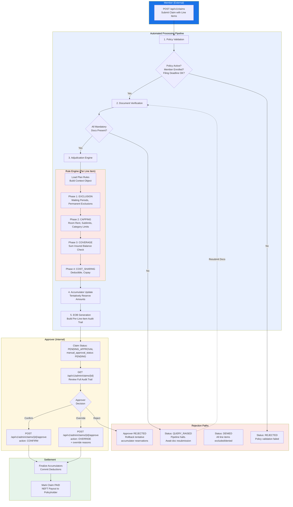

# Product Requirements Document (PRD): Indian Health Insurance Claims Processing System

## 1. Technology Stack
*   **API Framework:** FastAPI (Python)
*   **Database:** PostgreSQL
*   **Data Serialization/Validation:** Pydantic (Standard with FastAPI)
*   **Seeding & Infrastructure:** Docker with PostgreSQL `init.sql` scripts to load the initial Plans, Rules, Policies, and Members automatically.

---

## 2. Database Schema (PostgreSQL)

The database design uses highly normalized tables for core entities and utilizes `JSONB` columns for flexible configurations (like rule conditions and dynamic accumulator buckets).

### 2.1 Core Entities
*   **`plans`**
    *   `id` (PK, UUID)
    *   `name` (String)
    *   `created_at` (Timestamp)
*   **`policies`**
    *   `id` (PK, UUID)
    *   `plan_id` (FK -> plans.id)
    *   `tenure_start` (Date)
    *   `tenure_end` (Date)
    *   `policyholder_details` (JSONB - stores name, KYC, bank details)
*   **`members`**
    *   `id` (PK, UUID)
    *   `policy_id` (FK -> policies.id)
    *   `name` (String)
    *   `age` (Integer)
    *   `gender` (String)
    *   `ped_list` (JSONB - array of pre-existing diagnosis codes)
*   **`accumulators`**
    *   `policy_id` (PK/FK -> policies.id)
    *   `available_sum_insured` (Decimal)
    *   `category_usage` (JSONB - map of specific usage, e.g., `{"DENTAL": 20000}`)

### 2.2 Rule Engine Configurations
*(Note: Naming has been clarified from earlier designs to make the evaluation purpose explicit)*
*   **`rules`**
    *   `id` (PK, UUID)
    *   `plan_id` (FK -> plans.id)
    *   `name` (String)
    *   `execution_phase` (String Enum: e.g., `EXCLUSION`, `CAPPING`, `COVERAGE`, `COST_SHARING`) - *Defines WHEN the rule runs.*
    *   `priority` (Integer) - *Execution order within the phase.*
    *   `condition` (JSONB) - *The generic DSL tree (e.g., {"field": "...", "operator": "EQ"}).*
    *   `action_type` (String Enum: e.g., `LIMIT`, `EXCLUDE`, `COPAY`) - *Defines the specific mathematical handler to trigger.*
    *   `action_config` (JSONB) - *The parameters for the handler (e.g., {"max_amount": 100000, "accumulator_key": "DENTAL"}).*
    *   `is_active` (Boolean)

### 2.3 Claim Transactions
*   **`claims`**
    *   `id` (PK, UUID)
    *   `policy_id` (FK -> policies.id)
    *   `member_id` (FK -> members.id)
    *   `diagnosis_codes` (JSONB - Array of ICD-10 strings)
    *   `claim_type` (String: `REIMBURSEMENT`, `CASHLESS`)
    *   `status` (String Enum: `SUBMITTED`, `PENDING_APPROVAL`, `APPROVED`, `PARTIALLY_APPROVED`, `DENIED`, `PAID`)
    *   `manual_approval_status` (String Enum: `PENDING`, `APPROVED`, `OVERRIDDEN`, `REJECTED`) - Default is `PENDING`.
    *   `total_billed` (Decimal)
    *   `total_insurer_payable` (Decimal)
    *   `total_member_payable` (Decimal)
*   **`line_items`**
    *   `id` (PK, UUID)
    *   `claim_id` (FK -> claims.id)
    *   `service_category` (String: `ROOM_RENT`, `CONSULTATION`, `PHARMACY`, etc.)
    *   `status` (String Enum: `APPROVED`, `DENIED`, `NEEDS_REVIEW`)
    *   `billed_amount` (Decimal)
    *   `allowed_amount` (Decimal)
    *   `insurer_payable` (Decimal)
    *   `audit_trail` (JSONB - Array of adjustment records tracking the math, rule logic, and EOB explanation for this specific line item)

---

## 3. API Endpoints Specification

API routes are strictly separated between external actions (Member App) and internal operations (Admin/Approver portals).

### A. Member Endpoints (External)
Accessed by the policyholder to file and track claims.

| Method | Endpoint | Payload / Behavior |
| :--- | :--- | :--- |
| `POST` | `/api/v1/claims` | **Submit Reimbursement Claim:** Accepts `policy_id`, `member_id`, `diagnosis_codes` (Array), and `line_items`. Triggers pipeline up to `PENDING_APPROVAL`. |
| `GET` | `/api/v1/claims/{claim_id}` | **Check Status:** Returns high-level claim status and final financial totals. |
| `GET` | `/api/v1/claims/{claim_id}/eob` | **Download EOB:** Returns the finalized Explanation of Benefits detailing member liability and adjustment reasons. |

### B. Admin / Internal Endpoints (Approver)
Accessed by insurance company claims adjusters and underwriters.

| Method | Endpoint | Payload / Behavior |
| :--- | :--- | :--- |
| `GET` | `/api/v1/admin/claims/{claim_id}` | **Approver View:** Returns the claim including the **full per-line-item audit trail** generated by the engine. |
| `POST` | `/api/v1/admin/claims/{claim_id}/approve` | **Manual Approval:** Accepts `action` (`CONFIRM` or `OVERRIDE`) and optional override reasons. Finalizes accumulators and moves claim to `PAID` or `DENIED`. |
| `POST` | `/api/v1/admin/plans` | **Create Plan:** Ingests a new Plan object along with its associated generic JSON Rules. |
| `GET` | `/api/v1/admin/plans/{plan_id}` | **View Plan:** Returns plan details and active rules. |
| `POST` | `/api/v1/admin/policies` | **Issue Policy:** Creates a new Policy contract for a member. |
| `GET` | `/api/v1/admin/policies/{policy_id}` | **Inspect Balances:** Returns a policy's static details and its dynamic **Accumulator balances**. |

---

## 4. Architecture Flow: Claim Processing Pipeline

### Flow Summary

1. **Member submits** a claim with line items via `POST /api/v1/claims`.
2. **Policy Validation** checks if the policy is active, member is enrolled, and filing is within deadline. Fails → `REJECTED`.
3. **Document Verification** checks mandatory documents. Missing → `QUERY_RAISED` (pipeline halts until resubmission).
4. **Adjudication Engine** runs the Rule Engine on each line item through 4 fixed phases: `EXCLUSION` → `CAPPING` → `COVERAGE` → `COST_SHARING`. Each phase logs its deductions to the line item's `audit_trail`.
5. **Accumulator Update** tentatively reserves the approved amounts from the policy's sum insured and category buckets.
6. **EOB Generation** builds the final Explanation of Benefits with per-line-item status and explanations.
7. Claim halts at **`PENDING_APPROVAL`** with `manual_approval_status = PENDING`.
8. **Approver reviews** the full audit trail via `GET /api/v1/admin/claims/{id}` and submits their decision via `POST /api/v1/admin/claims/{id}/approve`:
   - **CONFIRM** → Accept the engine's output as-is.
   - **OVERRIDE** → Adjust amounts/statuses with mandatory reason (logged in audit trail).
   - **REJECT** → Deny the claim entirely, rollback tentative accumulator reservations.
9. On approval, accumulators are **finalized** and the claim moves to **`PAID`**.
